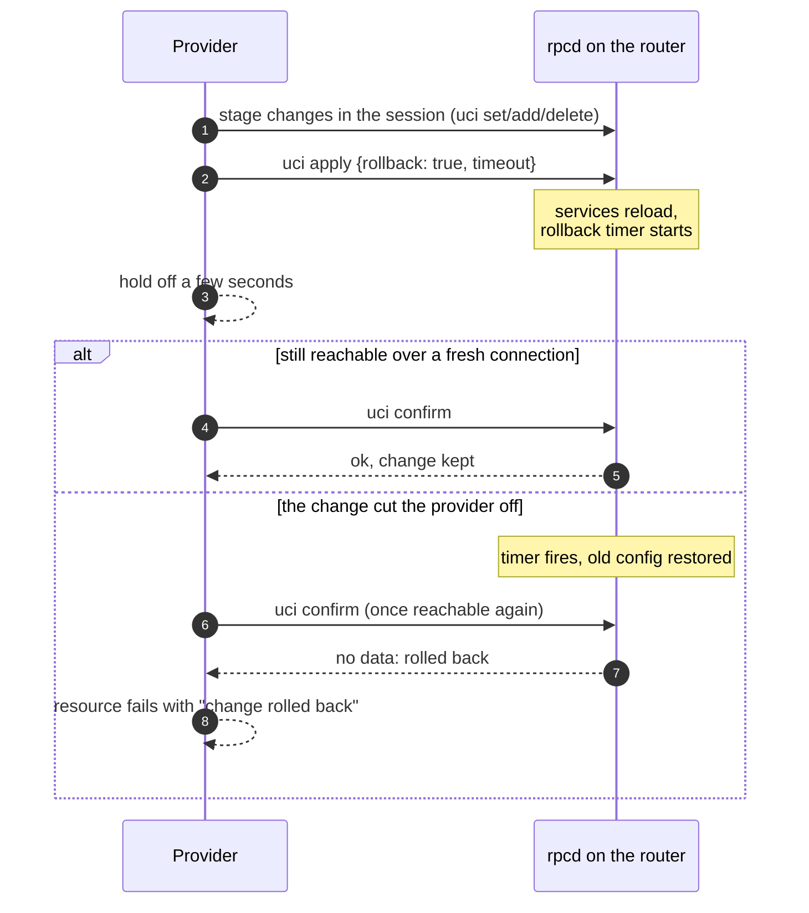

<div align="center">


# terraform-provider-openwrt

**Declarative OpenWrt routers for Terraform and OpenTofu, with a safety net.**

Every change is applied with `uci apply` rollback protection:<br>
if a plan cuts you off, the router quietly puts itself back.

[](https://github.com/reznakt/terraform-provider-openwrt/actions/workflows/ci.yml)
[](https://reznakt.github.io/terraform-provider-openwrt/)
[](https://openwrt.org)
[](https://opentofu.org)
[](https://www.terraform.io)
[](LICENSE)

[**Documentation**](https://reznakt.github.io/terraform-provider-openwrt/) ·
[Quick start](#quick-start) ·
[Resources](#whats-inside) ·
[Secrets](#secrets-stay-secret) ·
[Development](#development)

</div>

---

## Why

- 🛟 **Can't lock you out.** Changes go through `uci apply` with a rollback timer and are confirmed over a fresh connection. Break the LAN address, the firewall or uhttpd, and the router reverts on its own while the plan fails with `change rolled back`.
- 🧩 **Typed, validated, importable.** 44 resources for network, wireless, firewall, DHCP/DNS, system and services, generated from declarative specs, plus a generic `openwrt_uci_section` for everything else.
- 🔐 **Secrets stay secret.** Keys and passwords never show in plans; write-only `*_wo` attributes keep them out of state too, while still detecting drift.
- 🪶 **Nothing to install.** Talks to the ubus JSON-RPC API that LuCI already uses. No agent, no SSH, no extra packages.

## Quick start

**1. Give the provider a login on the router** (optional but recommended; `root` works too):

```sh
scp -O router/terraform-acl.json root@192.168.1.1:/usr/share/rpcd/acl.d/terraform.json
```

Then add an rpcd login for it as described in the [router setup guide](https://reznakt.github.io/terraform-provider-openwrt/guides/router-setup/).

**2. Configure the provider:**

```hcl
terraform {
  required_providers {
    openwrt = { source = "reznakt/openwrt" }
  }
}

provider "openwrt" {
  endpoint = "https://192.168.1.1" # password from OPENWRT_PASSWORD
  username = "terraform"
  insecure = true                  # uhttpd's self-signed certificate
}
```

**3. Describe your network:**

```hcl
resource "openwrt_network_interface" "iot" {
  section = "iot"
  proto   = "static"
  device  = "br-iot"
  ipaddr  = "192.168.20.1/24"
}

resource "openwrt_firewall_zone" "iot" {
  section = "zone_iot"
  name    = "iot"
  network = [openwrt_network_interface.iot.section]
  input   = "REJECT"
  output  = "ACCEPT"
  forward = "REJECT"
}

resource "openwrt_wireless_iface" "iot" {
  section        = "iot"
  device         = "radio0"
  mode           = "ap"
  network        = [openwrt_network_interface.iot.section]
  ssid           = "iot"
  encryption     = "sae-mixed"
  key_wo         = var.iot_wifi_key # never stored in state
}
```

**4. `tofu apply`.** Existing sections can be adopted with `import` blocks; [`examples/takeover`](examples/takeover) takes over a stock router end to end.

> [!NOTE]
> The provider is not on a registry yet. Build it with `nix build` (the result contains a ready filesystem mirror under `share/terraform/plugins`) or `go build`, and point `provider_installation` at it.

## How the safety net works



Changes are serialized across the whole run, because a router can only have one pending rollback at a time.

## What's inside

| Area | Resources |
|---|---|
| **Network** | `network_interface` · `network_device` · `network_bridge_vlan` · `network_route` · `network_route6` · `network_rule` · `network_rule6` · `network_globals` · `network_wireguard_peer` |
| **Wireless** | `wireless_device` · `wireless_iface` |
| **Firewall** | `firewall_defaults` · `firewall_zone` · `firewall_forwarding` · `firewall_rule` · `firewall_redirect` · `firewall_nat` · `firewall_ipset` · `firewall_include` |
| **DHCP & DNS** | `dhcp_dnsmasq` · `dhcp_pool` · `dhcp_host` · `dhcp_domain` · `dhcp_cname` · `dhcp_srv` · `dhcp_mx` · `dhcp_boot` · `dhcp_tag` · `dhcp_odhcpd` |
| **System** | `system` · `system_ntp` · `system_led` |
| **Services** | `dropbear` · `uhttpd` · `uhttpd_cert` · `rpcd` · `rpcd_login` · `sqm_queue` · `qos_*` |
| **Anything else** | `uci_section` · `uci_order` · `package` · `file` · `service` · `exec` |
| **Data sources** | `board` · `system_info` · `uci_section` · `uci_sections` · `network_interface` · `wireless_status` · `packages` · `dhcp_leases` · `file` |
| **Ephemeral** | `file` (read a secret from the router without persisting it) |

All names are prefixed with `openwrt_`. Full reference in the [documentation](https://reznakt.github.io/terraform-provider-openwrt/).

<details>
<summary><b>Semantics worth knowing</b></summary>

- A typed resource **owns the options it declares**: leaving an attribute unset removes that option on the router. Options it doesn't declare are left alone unless you list them in `extra_options` / `extra_lists`.
- `openwrt_uci_section` owns its **whole** section.
- Built-in sections (`openwrt_system`, `openwrt_firewall_defaults`, `openwrt_dhcp_dnsmasq`, radios, …) are **adopted** on create and only **forgotten** on destroy.
- Anonymous sections import as `@type[index]` and are renamed to the resource's `section` on the next apply. Changing `section` renames in place.
- Firewall rules are evaluated in file order; pin it with `openwrt_uci_order`.

</details>

## Secrets stay secret

| You write | Plan output | State | Drift detection |
|---|:---:|:---:|---|
| `key = var.psk` | hidden | stored | exact |
| `key_wo = var.psk` | — | **never** | salted fingerprint in private state |
| `key_file = "/run/secrets/psk"` (sops-nix, agenix) | — | path only | salted fingerprint in private state |
| `ephemeral "openwrt_file"` | — | **never** | read-only |

Write-only and file-based secrets are sent again whenever they change, with no version to bump. Secret-looking options are routed to `sensitive_options` in generic sections and withheld from data sources, provider logs are masked even at `TRACE`, and the test suite checks all of it. See the [secrets guide](https://reznakt.github.io/terraform-provider-openwrt/guides/secrets/).

## Development

Everything runs in `nix develop`; tasks live in the [`justfile`](justfile):

| Command | What it does |
|---|---|
| `just test` | unit tests + real OpenTofu runs against an in-memory fake router |
| `just test-one TestDHCPHost` | a single test |
| `just acc` | acceptance tests against a throwaway **OpenWrt VM** (QEMU, KVM when available) |
| `just lint` | treefmt check, golangci-lint, shellcheck, actionlint |
| `just fmt` | format Go, Nix, shell and HCL (also `nix fmt`) |
| `just docs` | regenerate `docs/` from the schema, templates and examples |
| `just vendor-hash` | recompute the Nix `vendorHash` after dependency changes |
| `just check` | everything CI runs except the VM suite |

CI runs lint, the sandboxed `nix flake check`, and the full acceptance suite in the VM on every push and pull request. The VM image is the official OpenWrt x86-64 release with the provider's ACLs baked in, and acceptance tests refuse to run against anything but a loopback endpoint.

<details>
<summary><b>Repository layout</b></summary>

| Path | Contents |
|---|---|
| `internal/ubus` | JSON-RPC client: login, session renewal, status codes |
| `internal/uci` | uci wrapper and the serialized apply → confirm → rollback manager |
| `internal/sections` | typed section specs, one table per config file |
| `internal/resources` | spec engine, other resources, data sources |
| `internal/secrets` | the rule deciding which option names are secrets |
| `internal/ubustest` | fake uhttpd + rpcd for tests |
| `router/` | rpcd ACL files to install on the router |
| `nix/` | package, VM image, VM helpers, docs site, formatter |

Adding a section type means adding one entry to a table in `internal/sections`.

</details>

## License

[MIT](LICENSE)
